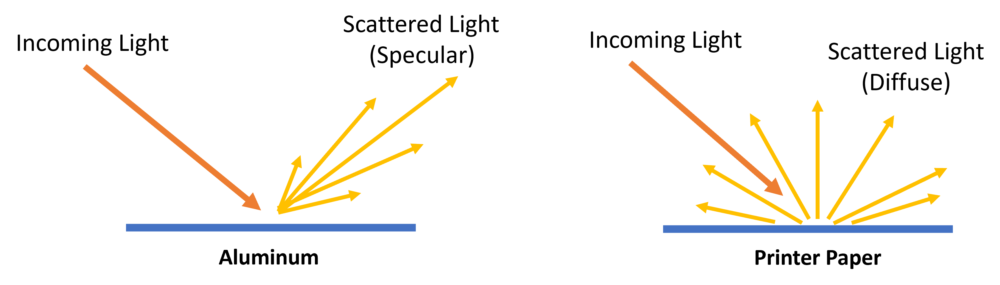

Tutorial
--------

There are 3 steps to estimate satellite brightness:

    1. Find BRDFs for the surfaces of a satellite and Earth's surface
    2. Create a brightness model based on BRDFs, normal vectors, and surface areas
    3. Calculate brightness

This tutorial will walk you through each of these steps
and give you some basic background knowledge about the most important concepts
underlying the Lumos brightness calculations. For a more formal and detailed information, 
see our paper `Satellite Optical Brightness (2023) <https://arxiv.org/abs/2305.11123>`_

For the purposes of this tutorial, instead of a complex satellite, we'll use a 
5 square meter aluminum plate. This is a very simple test case.

Installation
============
First, create a new directory:

.. code-block:: console

    $ mkdir lumos_tutorial
    $ cd lumos_tutorial

Create a Python virtual environment:

.. code-block:: console

    $ python -m venv venv
    $ venv/Scripts/activate.bat

Install Lumos using pip:

.. code-block:: console

   (.venv) $ pip install lumos-sat

Bidirectional Reflectance Distribution Function (BRDF)
======================================================

The BRDF describes how light is scattered by a surface. Shiny or glossy materials such 
as polished aluminum have a specular BRDF. Surfaces like this mostly scatter light
in the direction of perfect reflection. Diffuse materials such as a white piece
of paper have a nearly Lambertian BRDF, meaning light is scattered equally in allows
directions.

We need to know the BRDF for each surface of our satellite. This is one of the most important parts
of generating an accurate brightness model. The best way to go about this is to fit BRDF data
that has been measured in the lab to an empirical BRDF model. Fitting data to an empirical model
is useful because it can help get rid of measurement artifacts and is safer than extrapolating a
small number of BRDF measurements over a huge variety of angles.

Let's find a BRDF model for our aluminum plate. Start by downloading 
this CSV file :download:`Aluminum BRDF Data <_static/light_scatter.png>` and placing this file
in your working directory. This data is from CITATION.

Let's load and plot this data:
CODE
IMAGE

Next, let's use Lumos to fit this data to an ABG BRDF model. The ABG model is good for representing
specular BRDFs.
CODE
OUTPUT

Finally, let's plot our ABG BRDF model:
CODE
OUTPUT

Making a Satellite Model
========================

The Satellite-Centered Frame
============================

The Observer Frame
==================

Advanced Topics
===============