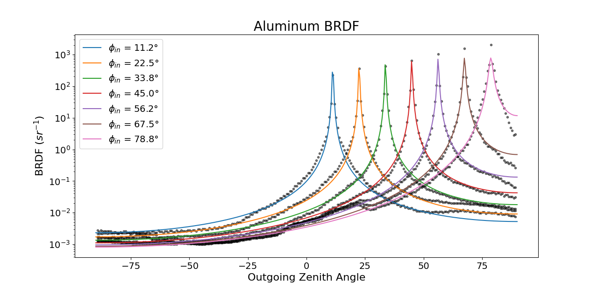
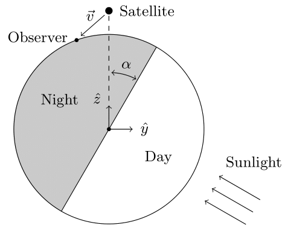
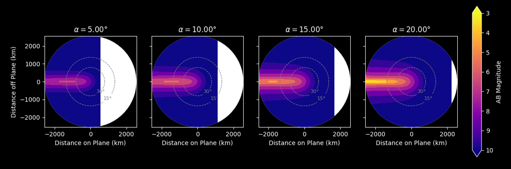
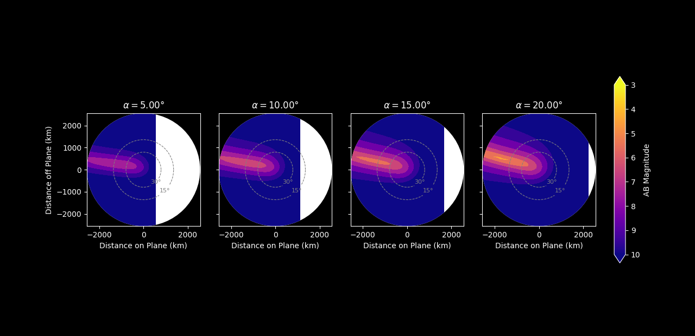
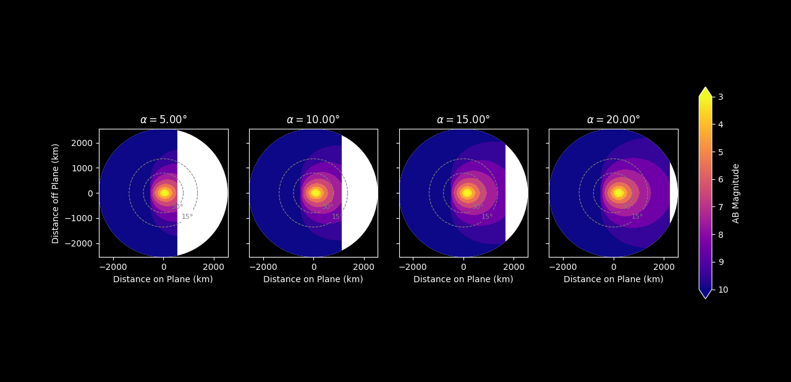
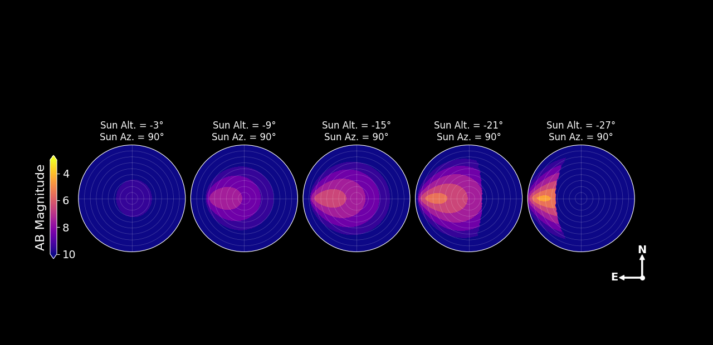

Basic Tutorial
--------------

There are 3 steps to estimate satellite brightness:

    1. Find BRDFs for the surfaces of a satellite and Earth's surface
    2. Create a brightness model based on BRDFs, normal vectors, and surface areas
    3. Calculate brightness

This tutorial will walk you through each of these steps
and give you some basic background knowledge about the most important concepts
underlying the Lumos brightness calculations. For a more formal and detailed information, 
see our paper `Satellite Optical Brightness (2023) <https://arxiv.org/abs/2305.11123>`_

For the purposes of this tutorial, instead of a complex satellite, we'll use a 
5 square meter aluminum plate. This is a very simple test case.

Installation
============

First, create a new directory:

.. code-block:: console

    $ mkdir lumos_tutorial
    $ cd lumos_tutorial

Create a Python virtual environment:

.. code-block:: console

    $ python -m venv venv
    $ venv/Scripts/activate.bat

Install Lumos using pip:

.. code-block:: console

   (.venv) $ pip install lumos-sat

Bidirectional Reflectance Distribution Function (BRDF)
======================================================

The BRDF describes how light is scattered by a surface. Shiny or glossy materials such 
as polished aluminum have a specular BRDF. Surfaces like this mostly scatter light
in the direction of perfect reflection. Diffuse materials such as a white piece
of paper have a nearly Lambertian BRDF, meaning light is scattered equally in allows
directions.

.. image:: _static/light_scatter.png
  :width: 800

We need to know the BRDF for each surface of our satellite. This is one of the most important parts
of generating an accurate brightness model. The best way to go about this is to fit BRDF data
that has been measured in the lab to an empirical BRDF model. Fitting data to an empirical model
is useful because it can help get rid of measurement artifacts and is safer than extrapolating a
small number of BRDF measurements over a huge variety of angles.

Let's find a BRDF model for our aluminum plate. Start by downloading 
this CSV file :download:`Aluminum BRDF Data <_downloads/aluminum_brdf.csv>` and placing this file
in your working directory. This BRDF data is from a catalog provided in 
the paper "A Data-Driven Reflectance Model (Matusik et. al 2006)"

.. note::
    Lumos uses a very specific BRDF file format. The first column is the ingoing zenith
    angle :math:`\phi_{in}`. The second column is the ingoing azimuth angle :math:`\theta_{in}`.
    The third and fourth columns are the outgoing angles :math:`\phi_{out}`, :math:`\theta_{out}`.
    The fifth column is the BRDF. The delimiter should be five spaces. Comments can be written using
    "#". See the aluminum BRDF file you just downloaded as an example.

Since we are working with aluminum, we'll fit our experimental BRDF data to an ABG model.
The ABG model is good for representing specular BRDFs. The model consists of three parameters
we need to fit: A, B, and g. You can read more about the ABG model here: 
`Scatter Models for Stray Light Analysis <https://photonengr.com/wp-content/uploads/2014/10/ApproximatedScatter1.pdf>`_
We use :py:func:`lumos.brdf.tools.fit` to find these three model parameters:

.. literalinclude:: ../../examples/fit_aluminum_brdf.py
    :linenos:
    :lines: 1-15
    :caption: fit_aluminum_brdf.py

.. code:: console
    
    A = 3.362e-03
    B = 4.309e-06
    g = 2.068

Next, we use Lumos to plot both our measured data points and our fitted model. This is an important
step to ensure we have a good fit.

.. literalinclude:: ../../examples/fit_aluminum_brdf.py
    :linenos:
    :lines: 17-29
    :lineno-start: 17
    :caption: fit_aluminum_brdf.py

Our fitted BRDF model looks good! Next, we can make a satellite model.

.. note::
    For more complex BRDFs, you will most likely want to use a Binomial model. Be careful
    when fitting binomial models, as these fits can easily "go wild" outside of measurements.

Making a Satellite Model
========================
For our brightness modeling, we treat a satellite as a collection of surfaces.
Each surface is defined by a normal vector, BRDF, and surface area. 

The normal vector of a surface must be given in the "satellite-centered frame". 
In this reference frame, :math:`\hat{z}` points to zenith. :math:`\hat{y}` is in 
the plane defined by the center of earth, the satellite, and the sun. 
:math:`\hat{x}` is defined by the right-hand-rule.
We also define angle :math:`\alpha`, the angle of the satellite past the terminator 
(night-day boundary). All of this geometry is shown below:

.. note::
    For example, the vector that points straight down (to geodetic nadir) from a satellite,
    usually corresponding to the underside of the satellite chassis would be: 
    :math:`\hat{n} = -\hat{z} = (0, 0, -1)`. 
    
    The vector that points from the satellite directly to the sun is given as:
    :math:`\hat{n} = \hat{y} \cos \alpha - \hat{z} \sin \alpha = (0, \cos \alpha, -\sin \alpha)`.

Let's make a new brightness model, consisting of just our aluminum plate, pointing towards the ground.
We start by making a new file, "simple_sat.py", where we define the surfaces of our model.

.. literalinclude:: ../../examples/simple_sat.py
    :linenos:
    :caption: simple_sat.py

Next, we can use this model to generate some brightness predictions.

The Satellite-Centered Frame
============================

Lumos provides a very simple interface to generate brightness predictions in the satellite frame.

.. literalinclude:: ../../examples/aluminum_satellite_frame.py
    :linenos:
    :lines: 1 - 15
    :caption: aluminum_satellite_frame.py

Let's unpack this image a bit. We are in the satellite's frame of reference, looking
down on the Earth's surface. The outer circle shows the horizon seen by the satellite, everything
outside of this circle is space. Observers on this circle would see the satellite exactly at the horizon.
The dashed-grey concentric circles mark observers on the ground, who, 
when looking at the satellite, see it at altitudes of 15 and 30 degrees respectively.
The white semi-circle to the left of each frame shows the portion of the Earth which is 
still illuminated by the sun. The vertical boundary between night and day is the terminator.
The bright streak to the right hand side of the images shows light scattered by our aluminum plate.

As the angle past terminator increases, more light is scattered for two reasons. First,
the aluminum plate's normal vector is oriented more directly towards the sun. Second,
the scattered light seen by observers on the ground is being reflected more and more specularly. 
Here's an interactive graph showing how this works:

.. raw:: html

    <iframe src="https://www.desmos.com/calculator/zdgghb27tq" width="700", height="500"></iframe>

While this reference frame may seem overly complicated, it is actually very useful when thinking about
satellite designs. As an example, let's try changing the normal vector of our aluminum surface.
First, we rotate the aluminum in the x-direction:

.. literalinclude:: ../../examples/aluminum_satellite_frame.py
    :linenos:
    :lines: 18-29
    :lineno-start: 18
    :caption: aluminum_satellite_frame.py

We can see how our surface now scatters light into the x-hat direction.

Let's rotate the aluminum 45 degrees in the y-direction. Now our specular peak is
below the satellite!

.. literalinclude:: ../../examples/aluminum_satellite_frame.py
    :linenos:
    :lines: 31-42
    :lineno-start: 31
    :caption: aluminum_satellite_frame.py

The following interactive graph shows how light is specularly scattered onto the ground
by our rotated aluminum plate:

.. raw:: html

    <iframe src="https://www.desmos.com/calculator/a2v0zi68ek" width="700", height="400"></iframe>

What if, instead of just plotting a brightness summary, we want to get the actual intensity
values calculated by Lumos? We simply call the calculation directly. Here's an example
which calculates the location of the observer that sees the brightest reflection from the
aluminum and the peak intensity of that reflection.

.. literalinclude:: ../../examples/aluminum_satellite_frame.py
    :linenos:
    :lines: 45-60
    :lineno-start: 45
    :caption: aluminum_satellite_frame.py

.. code-block:: console
    
    Peak Intensity: 130 nW / m^2
    Distance off Plane: -13 km
    Distance on Plane: 207 km

This matches the contour plot shown above.
See the API reference for more information about what is included in a 
:py:class:`lumos.geometry.GroundObservers` object.

The satellite-centered frame is great for satellite operators, since this frame shows how
design decisions affect brightness in the frame of a satellite. On the other hand, astronomers
would like to know how satellite brightness will impact the night sky. For this, we use a different
reference frame.

The Observer Frame
==================

In the observer frame, the position of a satellite in the sky and the position of the sun
in the sky are both specified by their altitude and azimuth. Altitude is the angle in
degrees of an object from the horizon. Azimuth is the angle of the object from due north.
Internally, Lumos converts these sky positions to coordinates in the brightness frame, then
calculates brightness.

Let's see an example using our nadir-facing aluminum plate:

.. literalinclude:: ../../examples/aluminum_observer_frame.py
    :linenos:
    :lines: 1-10
    :lineno-start: 1
    :caption: aluminum_observer_frame.py

.. warning::
    You must always specify exactly 5 sun altitudes and 5 sun azimuths for 
    :py:func:`lumos.plot.brightness_summary_observer_frame` to work.

So what does this image show? Each circle shows a view of the entire night sky. The contour
color is filled according to the brightness a satellite would appear if it was in that point
in the sky. The center corresponds to a satellite straight overhead. North, West, South, and East
are marked on the edge of the circle (which is the horizon). Altitude is shown in increments
of 10 degrees. As an example, we see that when the sun is at -27 degrees, the brightest satellites
would be in the eastern sky, about 25 degrees above the horizon. This light is forward scattered
by our nadir aluminum plate. In most of the western sky and directly overhead, 
satellites are shadowed by Earth.

To get numerical intensity values we can call the Lumos calculator directly:

.. literalinclude:: ../../examples/aluminum_observer_frame.py
    :linenos:
    :lines: 13-40
    :lineno-start: 13
    :caption: aluminum_observer_frame.py

.. code-block:: console

    Brightest: 4.6 AB Magnitude
    Altitude: 23°
    Azimuth: 91°

.. note::
    To find the altitude and azimuth of the sun at a specific time and location,
    you can use :py:func:`lumos.calculator.get_sun_alt_az`. You must pass in an
    :py:class:`astropy.time.Time` object and a :py:class:`astropy.location.EarthLocation`
    object.

Conclusion
==========

That wraps up everything you need to know for the most basic usage of Lumos. Head over to
Advanced Topics for more helpful tips.